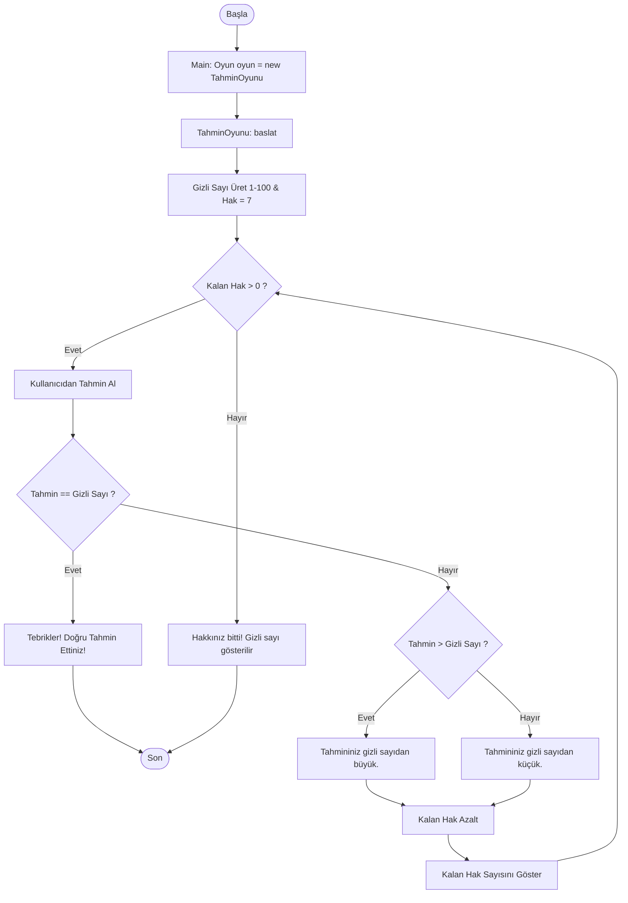

# 🎯 Sayı Tahmin Oyunu (Number Guessing Game)


Java programlama dili ve **Nesne Yönelimli Programlama (OOP)** prensipleri kullanılarak geliştirilmiş konsol tabanlı bir sayı tahmin etme oyunu.

---

## 📌 Proje Özeti

Kullanıcı, bilgisayar tarafından rastgele seçilen 1 ile 100 arasındaki gizli bir sayıyı en fazla **7 hak** kullanarak bulmaya çalışır. Program her tahminde kullanıcıya sayının büyük veya küçük olduğuna dair yönlendirici ipuçları verir ve kalan hak sayısını ekrana yansıtır.

---

## ✨ Özellikler

- 🎲 **Dinamik Rastgele Sayı Üretimi:** `java.util.Random` ile 1-100 arasında rastgele gizli sayı belirlenir.
- 🎯 **7 Hak Sınırlaması:** Kullanıcıya optimal tahmin için 7 hak tanınır.
- 💡 **Yönlendirici Geri Bildirim:** Girilen tahminin gizli sayıdan büyük veya küçük olduğunu anlık bildirir.
- 🛡️ **Girdi Doğrulama (Input Validation):** Geçersiz karakter veya aralık dışı girişlere karşı koruma.
- 🏛️ **Genişletilebilir Mimari:** Yeni oyun modları (ör. farklı zorluk seviyeleri, kelime tahmin oyunları) kolayca eklenebilir.

---

## 🏛️ Nesne Yönelimli Programlama (OOP) Mimarisi

Proje, yazılım mühendisliği standartlarına uygun olarak modüler bir OOP yapısında tasarlanmıştır:

| Bileşen | Tip | Açıklama |
| :--- | :--- | :--- |
| `Oyun` | **Interface (Arayüz)** | Soyutlama (*Abstraction*). Tüm oyun türlerinin sahip olması gereken `baslat()` ve `tahminEt()` sözleşmelerini tanımlar. |
| `OyunTabani` | **Abstract Class (Soyut Sınıf)** | Kodun yeniden kullanılabilirliği (*Code Reusability*). Gizli sayıyı üretir, kapsüller ve tahmin karşılaştırma mantığını yönetir. |
| `TahminOyunu` | **Concrete Class (Somut Sınıf)** | Kalıtım (*Inheritance*). `OyunTabani` sınıfından türetilmiştir; kullanıcı konsol etkileşimini ve hak kontrolünü yönetir. |
| `Main` | **Main / Driver Class** | Çok Biçimlilik (*Polymorphism*). `Oyun oyun = new TahminOyunu();` referansı ile oyunu başlatır. |

### 📊 Akış Şeması (Flowchart)



---

## 📁 Klasör Yapısı

```text
sayi-tahmin-oyunu/
│
├── src/
│   └── proje/
│       ├── Oyun.java          # Oyun arayüzü (Interface)
│       ├── OyunTabani.java    # Temel oyun mantığı (Abstract Class)
│       ├── TahminOyunu.java   # Konsol oyun akışı (Subclass)
│       └── Main.java          # Uygulama giriş noktası (Main Class)
│
├── .gitignore                 # Git tarafından yok sayılacak dosyalar
└── README.md                  # Proje dokümantasyonu
```

---

## 🚀 Kurulum ve Çalıştırma

### Gereksinimler
- Java JDK 8 veya üzeri (Java 11 / 17 / 21 önerilir)
- Git (isteğe bağlı)

### 1. Projeyi Klonlayın
```bash
git clone https://github.com/tugceyntr/java-number-guessing-game.git
cd java-number-guessing-game
```

### 2. Komut Satırından Derleme ve Çalıştırma
```bash
# Derleme
javac -encoding UTF-8 -d bin src/proje/*.java

# Çalıştırma
java -cp bin proje.Main
```

### 3. Eclipse veya IntelliJ IDEA ile Çalıştırma
1. IDE'nizde **File -> Open Projects from File System** (veya **Open**) seçeneğini kullanın.
2. Proje dizinini seçin.
3. `src/proje/Main.java` dosyasını açıp sağ tıklayarak **Run As -> Java Application** seçeneğini tıklayın.

---

## 💻 Örnek Oyun Deneyimi

```text
==================================================
          SAYI TAHMİN OYUNUNA HOŞ GELDİNİZ        
==================================================
1 ile 100 arasında bir sayı tuttum. Tahmininizi girin:

Tahmininiz: 50
Tahmininiz gizli sayıdan büyük.
6 hakkınız kaldı.

Tahmininiz: 25
Tahmininiz gizli sayıdan küçük.
5 hakkınız kaldı.

Tahmininiz: 37
Tebrikler! Doğru tahmin ettiniz!
==================================================
```

---

## 👤 Geliştirici

- **Tuğçe Yentür** - *Yönetim Bilişim Sistemleri (MIS)*
- GitHub: [@tugceyntr](https://github.com/tugceyntr)

